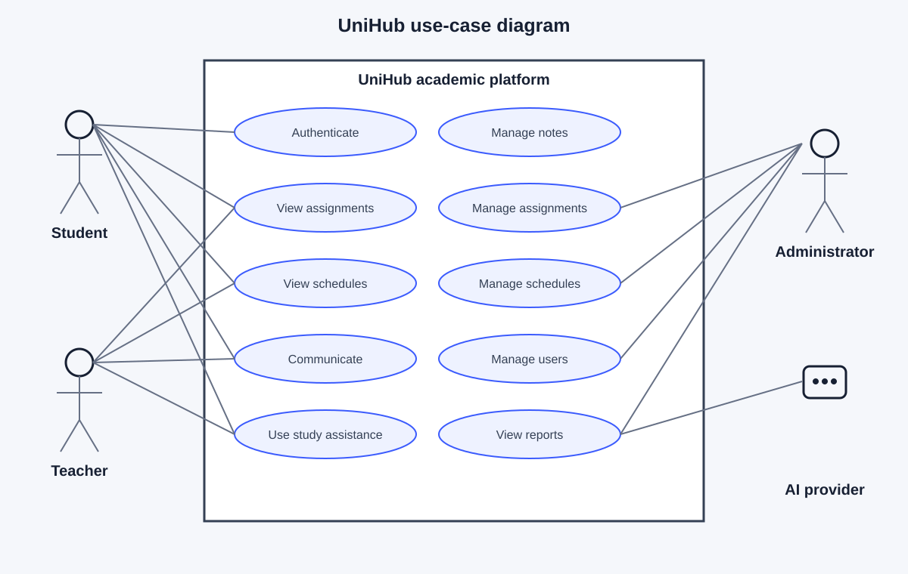
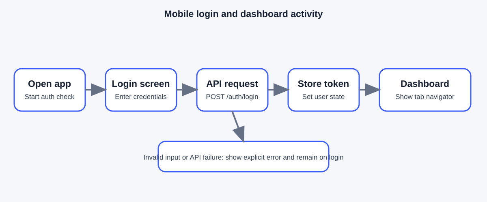
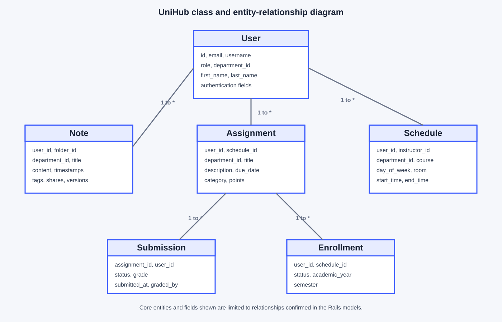
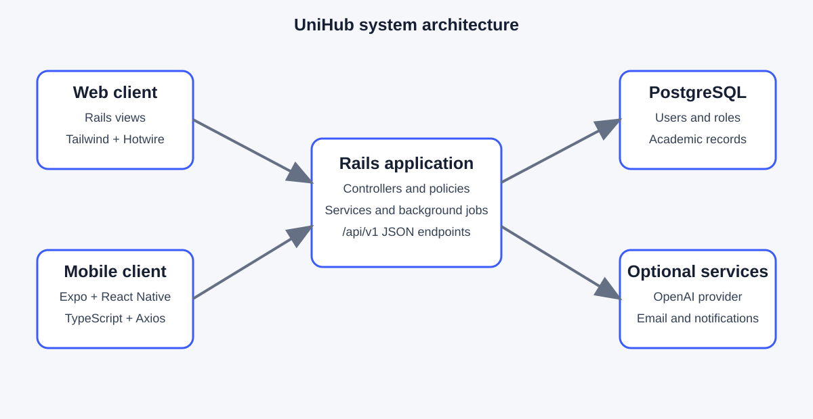

# UNIVERSITY OF MANAGEMENT AND TECHNOLOGY (UNIMTECH)

## School of Technology
### Department of Computer Science

**UniHub: A Web and Mobile Academic Support Platform**

Prepared by: **[Student name]**  
Student ID: **[Student ID]**  
Supervisor: **[Supervisor name]**  
Date: **3 September 2026**

---

# Table of Contents

1. Project Overview  
2. Development Methodology  
3. Product Evaluation and Outcomes  
4. Analysis and Reflective Discussion  
5. Conclusion and Recommendations  
References  
Appendices

---

# 1. Project Overview

UniHub is a university-focused academic support platform that combines a Ruby
on Rails web application with a React Native and Expo mobile client. It brings
notes, assignments, schedules, communication, dashboards, reporting, and
AI-supported study tools into one system.

My objective was to develop a practical platform that helps students organise
learning materials and deadlines while giving teachers and administrators tools
for academic management. I used incremental development: I reviewed the
existing Rails application, defined mobile API needs, implemented
authentication and notes integration, and built the main mobile screens. I
also improved the web AI service, dashboards, reporting, and role-based
workflows. Testing combined model and controller checks, smoke tests,
API-oriented checks, and a production web build. The repository records 52 of
52 documented tests as passed, while formal user-acceptance results and some
mobile API integrations remain outstanding. The report therefore distinguishes
implemented functionality from planned or partially migrated features.

**Figure 1: UniHub student collaboration visual.** This is an existing
frontend hero asset used to represent the academic community and is included
as a project visual, not as generated evidence of a completed workflow.

---

# 2. Development Methodology

## 2.1 Development Approach

I used an Agile and incremental approach. This was appropriate because UniHub
contains several connected modules and the mobile client was being developed
alongside an existing Rails system. Instead of waiting for every feature to be
specified before coding, I divided the work into planning, API design,
authentication, core mobile features, advanced features, and testing/deployment.
Each increment produced something that could be inspected, tested, and revised.

The work began with an audit of the Rails models, controllers, routes, and
existing views. I then treated authentication as the first mobile dependency:
without a reliable login state, the remaining screens could not be tested as a
real user would experience them. After that, I connected notes to the API and
built the dashboard, assignments, schedule, messages, profile, and AI screens.
Feedback from build errors and navigation behaviour led to several iterations,
including changes to token storage, API response handling, and navigation.

## 2.2 Requirement Analysis

I analysed requirements from the existing application, its route structure,
models, implementation notes, testing documents, and the mobile migration plan.
This document analysis showed that UniHub serves several roles. Students need
to read and create learning content, submit work, view schedules, and receive
academic support. Teachers need to create assignments and schedules, review
submissions, and communicate with students. Administrators and department
users need dashboards, user management, analytics, and reports.

The key problem was not a lack of individual academic tools; it was the
separation of those tools across different workflows and, initially, across a
web-only interface. The mobile work therefore focused first on access to the
most frequently used student functions while retaining the Rails application
as the backend and source of existing domain rules.

## 2.3 Data Collection Methods

The initial requirements were gathered through my experience as a student at
UNIMTECH. I considered the routine difficulties involved in keeping track of
assignments, schedules, notes, attendance information, and communication when
these activities are spread across different channels. This experience helped
me define the central problem as a lack of one accessible academic workspace,
rather than simply a need for another standalone notes or messaging tool.

I supported this personal assessment with an informal review of existing
academic software frameworks and open-source tools. I compared the types of
functions they made available with the needs I had identified as a student,
paying particular attention to mobile access, organisation of academic work,
and the usefulness of feedback or analytical information. This was a practical
technical review, not a formal survey or benchmark study, so I use it to
explain the design direction rather than to claim measured superiority over
other systems.

I then mapped the day-to-day activities of students and teachers into system
requirements. The resulting feature map was translated into the PostgreSQL
data structures, Rails models and controllers, routes, and role-based
workflows. Users, notes, assignments, schedules, messages, dashboards, and
administrative functions were treated as connected parts of the same academic
process. When the mobile extension was planned, the existing Rails
implementation became the technical baseline: its relationships and response
structures helped determine which records and actions needed mobile screens
and API endpoints. I refined the priorities through implementation, manual
observation, build output, and testing. The repository contains no verified
questionnaire, interview transcript, or formal comparative study, so none is
presented as evidence in this report.

## 2.4 System Requirements

### Functional requirements

1. Users can register, log in, refresh a session, view their profile, and log
   out.
2. Authenticated users can create, read, update, and delete notes through the
   web application and notes API.
3. Notes can be organised with folders and tags, searched, shared, exported,
   and versioned in the web system.
4. The web system enables students to view assignments, submit work, and view
   status, grades, and feedback.
5. The web system enables teachers to create and manage assignments, schedules,
   and grading workflows.
6. The web system enables students to view enrolled schedules in calendar or
   list form.
7. The web system enables users to communicate through messages and discussions
   and receive notifications where the relevant features are enabled.
8. The dashboard presents role-specific academic information and actions.
9. AI functions can summarise academic text and generate study questions or
   hints, subject to validation, configuration, and rate limits.
10. The mobile client provides navigation for Home, Notes, Assignments,
    Schedule, Messages, Profile, and UniHub AI; full mobile API parity remains
    in progress.

### Non-functional requirements

- **Security:** authenticated routes, role-based permissions, protected API
  keys, token persistence, and server-side validation.
- **Usability:** clear empty states, responsive layouts, readable forms,
  actionable feedback, and consistent navigation.
- **Performance:** avoid unnecessary API calls, use efficient database
  associations, and apply AI request limits.
- **Maintainability:** separate Rails models, controllers, services, views,
  and mobile service/context layers.
- **Reliability:** explicit API error handling, refresh-token handling, and
  safe fallback behaviour when AI configuration is unavailable.
- **Compatibility:** web and mobile clients should use the same backend
  contracts, with platform-aware API URLs.
- **Privacy:** do not expose credentials or API keys; restrict notes and
  academic records to authorised users.

## 2.5 System Design

### Use-case design

The main actors are Student, Teacher, Administrator, and the AI provider.
Students authenticate, manage notes, view assignments and schedules, use study
assistance, and communicate. Teachers manage academic work and schedules.
Administrators manage users, departments, dashboards, and reports. The AI
provider receives validated academic text only when the service is configured.

The use-case design identifies the Student, Teacher, Administrator, and AI
provider as the main actors. Their interactions are shown in Figure 2. The
diagram is a code-derived project artefact based on the roles and workflows
documented in the Rails routes, models, and service classes; it should be
reviewed by the supervisor before final submission.

**Figure 2: UniHub use-case diagram.** The diagram maps the documented actors
to the principal academic, administrative, and AI-assisted workflows.

### Activity design

The principal mobile activity is: open application, check stored token,
display login when unauthenticated, submit credentials, receive the normalised
user response, enter the tab navigator, select a feature, call the API, show
success or an explicit error, and return to the authenticated state. Notes add
the validation branch: a blank title or content produces a message; valid input
is posted to `/api/v1/notes`, then inserted into the local list.

**Figure 3: Mobile login and dashboard activity.** This reflects the
authentication sequence implemented in the mobile context and API service.

### Class and ER design

The central `User` record has associations with notes, assignments,
submissions, schedules, enrollments, quizzes, messages, notifications, AI
usage logs, dashboards, and learning insights. `Note` belongs to a user and can
belong to a folder or department; it also relates to tags, shares, quizzes,
and content versions. `Assignment` relates to its creator and submissions,
while `Schedule` relates to its instructor and schedule participants.

The class and ER design is centred on `User`, `Note`, `Assignment`,
`Submission`, `Schedule`, `Enrollment`, and their supporting associations.
Figure 4 presents a professional, code-derived view of these core entities.
Each entity is shown as a class-style table containing selected attributes,
while the connecting lines represent the associations implemented in the Rails
models. The `1 to *` notation indicates a one-to-many relationship: one
instance of the parent entity can be associated with multiple instances of the
related entity. For example, one user can own multiple notes, create multiple
assignments, and have multiple submissions or enrolments. An assignment can
also receive multiple submissions, while a schedule can contain multiple
enrolments.

The diagram is intended to communicate the main data structure and the way
academic records depend on one another. It shows only fields and relationships
confirmed in the Rails source; it does not replace a supervisor-approved
database diagram if one is required.

**Figure 4: UniHub class and ER diagram.** This diagram is derived from the
confirmed model associations and selected model attributes in the Rails source.

### System architecture and data flow

The system uses a layered architecture. The Rails application contains the
web interface, controllers, models, policies, background jobs, and services.
PostgreSQL stores application data. The JSON API under `/api/v1` supplies the
mobile client. The Expo/React Native client contains screens, navigation,
authentication context, and an Axios service. OpenAI is an external dependency
for configured AI requests. Action Cable and background jobs support
communication and scheduled notifications in the web system.

**Figure 5: UniHub system architecture.** This diagram is derived from the
repository's Rails routes, service layer, database models, and mobile API
client.

### User-interface design

The web interface uses Tailwind CSS, role-specific dashboards, cards, status
indicators, forms, sidebar navigation, and empty states. The mobile interface
uses a consistent colour palette, bottom tabs, cards, headings, input forms,
and clear actions. The mobile login and dashboard were revised after
authentication and visual-design issues were identified.

## 2.6 Technologies and Tools

| Area | Technology or tool | Use |
|---|---|---|
| Backend | Ruby 3.3.6, Rails 8.0.3 | Selected for the existing MVC structure, conventions, API support, and mature Active Record integration |
| Database | PostgreSQL | Selected for relational academic records, associations, constraints, and reliable production support |
| Web UI | Tailwind CSS, Hotwire | Selected for responsive styling and focused browser interactions without a separate web SPA |
| Mobile | React Native 0.73.6, Expo 50 | Selected to share one TypeScript codebase across Android, iOS, and web |
| Language | TypeScript | Selected to make mobile API contracts and component state safer to maintain |
| Networking | Axios | Selected for reusable requests, interceptors, token headers, and refresh handling |
| Navigation | React Navigation | Selected for an authentication stack and predictable bottom-tab navigation |
| Authentication | Devise and token endpoints | Selected to preserve the Rails authentication system while supporting mobile sessions |
| AI | OpenAI GPT-3.5-turbo service | Selected for academic summarisation and question generation with configurable limits and mock mode |
| Testing | Rails tests, Jest/RN Testing Library plan | Selected to test backend rules and provide a path for mobile component and integration testing |
| Version control | Git and GitHub | Selected to track iterations, review changes, and preserve the development history |

## 2.7 System Development

I began by documenting the backend architecture and API schema. The mobile
project was scaffolded with Expo and TypeScript, then the authentication
context and API service were implemented. The API service normalises the
backend's wrapped `{ success, data }` response and stores tokens using
web-safe AsyncStorage or native secure storage with a fallback.

The first mobile integration exposed a race between the initial authentication
check and a successful login. I added stale-operation protection so an older
startup request could not clear a newly authenticated user. I also corrected
the web entry point, which had been rendering the login screen directly rather
than the root navigator. Platform-specific URLs were added for browsers and
Android emulators.

After authentication, I built the main screens and connected note creation.
The dashboard includes greeting, statistics, schedule and task areas, quick
actions, and AI access. The AI mobile screen currently demonstrates prompt
suggestions and a local study-tip response; it should not be described as a
completed server AI integration without additional evidence. The Rails AI
service separately supports configured OpenAI calls, mock mode, validation,
logging, and rate limiting.

## 2.8 Testing Methodology

I used several levels of testing. Model and validation tests checked users,
assignments, submissions, schedules, and associations. Controller and
integration checks covered authentication, authorisation, routes, and
feature workflows. Smoke tests checked the database, key models, mailer/job
configuration, and routes. I also reviewed role-specific access, responsive UI,
login transitions, and mobile navigation during development. The migration
strategy defines Jest/React Native Testing Library and Detox-style tests, but
these planned tests are not presented as executed results.

The project testing report records 8/8 smoke tests and 52/52 documented tests
passed on 30 October 2025. The mobile production web build was also recorded
as successful. A full TypeScript check still reported a pre-existing missing
`expo-router` module, so this limitation should be resolved before claiming a
clean type-check.

## 2.9 Challenges Encountered and Solutions

The first challenge was mobile token storage on the web platform. Native
Keychain methods were not reliable in the browser, so the service bypasses
Keychain on web and uses AsyncStorage. Native failures have an explicit
fallback, while the report does not treat browser storage as equivalent to
native secure storage.

The second challenge was the login-to-dashboard transition. The web entry point
and a race in the authentication context both contributed to the problem. I
changed the entry point to render `RootNavigator` and added operation-token
guards to prevent stale checks from overwriting current authentication.

A third challenge was the mismatch between the backend response envelope and
the mobile service types. I added response unwrapping in one API layer so
authentication and notes consume a consistent shape. I also replaced a
problematic icon-package usage with text glyphs after the web bundler could
not parse JSX in the icon package.

Finally, the mobile migration is broader than the currently exposed mobile
API. Assignments, schedules, messaging, notifications, and analytics exist
strongly in the web application, but several remain to be wired into the
mobile API. I treated those screens as UI scope and documented the integration
gap instead of claiming complete parity.

---

# 3. Product Evaluation and Outcomes

## 3.1 Developed System

The developed product is a Rails-based academic platform with a companion
Expo mobile client. The web system contains the broadest set of features,
including academic records, dashboards, collaboration, notifications,
reporting, and AI services. The mobile client provides the authentication
foundation, a student-oriented dashboard, notes, navigation to academic
sections, and an AI assistant interface.

## 3.2 System Features

- **Dashboard:** role-aware statistics, upcoming work, schedules, quick
  actions, and AI recommendations in the web system; student-focused cards in
  mobile.
- **Notes:** CRUD operations, validation, folders, tags, search, sharing,
  Markdown export, version history, and mobile note creation.
- **AI module:** configurable summarisation, question generation, study hints,
  mock mode, rate limiting, logging, and error messages.
- **Assignments and submissions:** teacher management, student submission,
  grades, feedback, resubmission rules, and status views.
- **Schedules:** teacher creation and enrolment management, student calendar
  and list views, filters, and conflict detection.
- **Communication:** messages, conversations, discussions, and notifications
  in the web application.
- **Reporting and administration:** department reports, analytics dashboards,
  user management, and administrative views.

## 3.3 System Interface

The final report should include verified screenshots with captions. The
repository snapshot reviewed for this draft does not contain a complete
evidence set of screenshots, so the following are deliberate placeholders:

**Figure 1: Login Interface** — [INSERT VERIFIED FINAL SCREENSHOT AND DATE]

**Figure 2: User Dashboard** — [INSERT VERIFIED FINAL SCREENSHOT AND DATE]

**Figure 3: Administration Dashboard** — [INSERT VERIFIED SCREENSHOT AND ROLE]

**Figure 4: AI Module** — [INSERT VERIFIED SCREENSHOT AND STATE WHETHER MOCK OR
LIVE]

**Figure 5: Reporting Interface** — [INSERT VERIFIED SCREENSHOT AND ROLE USED]

## 3.4 Testing Results

| Test case | Expected result | Actual result | Status |
|---|---|---|---|
| Database connection smoke test | Application connects to test database | Project testing report records success | Passed (documented) |
| User model validation | Invalid user data is rejected | Required validations recorded as working | Passed (documented) |
| Assignment validation | Required fields and dates are enforced | Validation checks recorded as working | Passed (documented) |
| Schedule validation | Invalid times and conflicts are rejected | Checks recorded as working | Passed (documented) |
| Role-based access | Students cannot manage teacher-only records | Authorisation checks recorded as working | Passed (documented) |
| Notes API create | Valid authenticated request creates a note | Endpoint and mobile POST integration are implemented; rerun evidence required | [VERIFY] |
| Mobile production web build | Bundle completes without build failure | Build recorded as successful | Passed (documented) |
| Full TypeScript check | No unresolved type/module errors | Missing pre-existing `expo-router` module was reported | [OPEN ISSUE] |
| Formal user acceptance | Real users complete agreed tasks | No participant dataset is present in the repository | [PENDING] |

## 3.5 User Evaluation

Formal user-evaluation data was not available in the reviewed project
evidence. I therefore do not claim satisfaction percentages or task-completion
rates. Before submission, I should test the agreed workflows with a recorded
sample and add the following table.

| Participant/role (anonymous) | Task | Completed? | Difficulty/comment |
|---|---|---|---|
| [P01/student] | Log in and open dashboard | [ ] | [ADD OBSERVATION] |
| [P02/student] | Create a note | [ ] | [ADD OBSERVATION] |
| [P03/teacher] | Create an assignment | [ ] | [ADD OBSERVATION] |
| [P04/admin] | Open a report | [ ] | [ADD OBSERVATION] |

---

# 4. Analysis and Reflective Discussion

The project met an important part of its original goal: it established a
working academic platform and a mobile foundation that can reach the same
backend. The strongest outcome was not a single screen but the connection
between authentication, API normalisation, navigation, and feature screens.
Once the authentication race and web entry-point error were corrected, the
mobile experience could behave as an application rather than a collection of
isolated screens.

The Rails application also demonstrated a mature domain model. Features such
as role-specific assignments, schedule conflict detection, note sharing,
version history, notifications, and reporting show that the platform is more
substantial than a basic note-taking prototype. The AI service was designed
with practical safeguards: it validates input, records usage, supports a
controlled mock mode, handles external-service errors, and limits requests.
These choices matter because an academic assistant must remain predictable
when an external AI provider is unavailable.

At the same time, the evaluation shows a gap between backend breadth and
mobile completeness. The migration plan identifies several mobile API tasks
that remain open. This means that a polished mobile screen alone does not
prove that the corresponding feature is fully functional end to end. I learned
to separate interface progress from integrated product progress and to state
that distinction in testing results.

I also learned that authentication is a system concern, not just a login-form
concern. Storage APIs differ between native and web environments; API
responses may be wrapped differently from the client types; and startup
requests can race with user actions. Solving these problems in the shared API
and authentication layers was more reliable than adding screen-specific
workarounds.

The documented tests provide useful confidence in the Rails models, routes,
authorisation, and core workflows. However, the evidence is mainly project
documentation and should be supplemented with current reruns, mobile
component tests, API integration tests, screenshots, and user acceptance
records. I would also resolve the missing `expo-router` dependency or remove
the stale reference so that the TypeScript check reflects the actual project.

If I continued the project, I would prioritise exposing assignments, schedules,
messages, notifications, and AI endpoints consistently through `/api/v1`.
Next I would add automated mobile tests for login, token refresh, note
creation, tab navigation, and API failure states. I would then conduct a small,
documented user evaluation and measure task completion time, error frequency,
and perceived usefulness. For AI, I would add clear provenance and academic
integrity guidance so that generated summaries support learning rather than
replace a student's own work.

Personally, the project changed how I estimate development work. I initially
treated visual screens as the visible milestone, but the most time-consuming
work was hidden in contracts, state transitions, platform differences, and
error handling. In future I would define an end-to-end acceptance test for
each feature before polishing its appearance. I would also keep the migration
tracker updated as implementation changes, because an accurate tracker makes
the remaining risk easier to see.

---

# 5. Conclusion and Recommendations

I developed UniHub as a Rails academic platform with an Expo/React Native
client, implemented core authentication and notes integration, and documented
working web features, AI services, dashboards, academic workflows, and
testing evidence. The project is a functional foundation, but complete mobile
feature parity and formal user evaluation remain future work.

I recommend completing the remaining mobile APIs, rerunning the full test
suite, resolving the TypeScript module issue, adding verified screenshots and
user-evaluation data, and documenting AI use according to university policy.

---

# References

Ruby on Rails. (n.d.). *Ruby on Rails Guides*.  
React Native. (n.d.). *React Native documentation*.  
Expo. (n.d.). *Expo documentation*.  
OpenAI. (n.d.). *API documentation*.  
University of Management and Technology. (2026). *Guidelines for project
report*.

# Appendices

**Appendix A:** Approved questionnaire/interview questions and anonymised
responses, if conducted.  
**Appendix B:** Verified screenshots and test logs.  
**Appendix C:** Selected API request/response examples with secrets removed.  
**Appendix D:** Final use-case, activity, class, ER, architecture, and data
flow diagrams.
